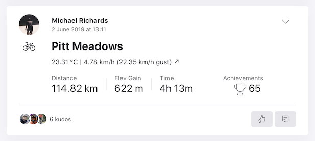

# strava-weather-stamp

Add atmospheric conditions, such as temperature and wind speed/direction, to your activities on Strava.



## Prerequisites

1. First obtain a [Dark Sky](https://darksky.net/dev) API key.
2. Next, create a [Strava API application](https://www.strava.com/settings/api) (in your account settings) and take note of your client ID and secret.

## Installation

1. Git clone or download this repository.
2. Install dependencies: `$ npm install`.
3. Fill in `config.json` with your Dark Sky API key, Strava client ID and client secret.
4. Allow API access to your Strava account: `$ npm run handshake`.

## Usage

To weather stamp your most recent activity:

```
$ npm run stamp
```

The command will output the activity title along with the updated description:

```
Triple Crown w/ Milos
12.92 °C | 5.76 km/h (12.21 km/h gust) ↖
```
